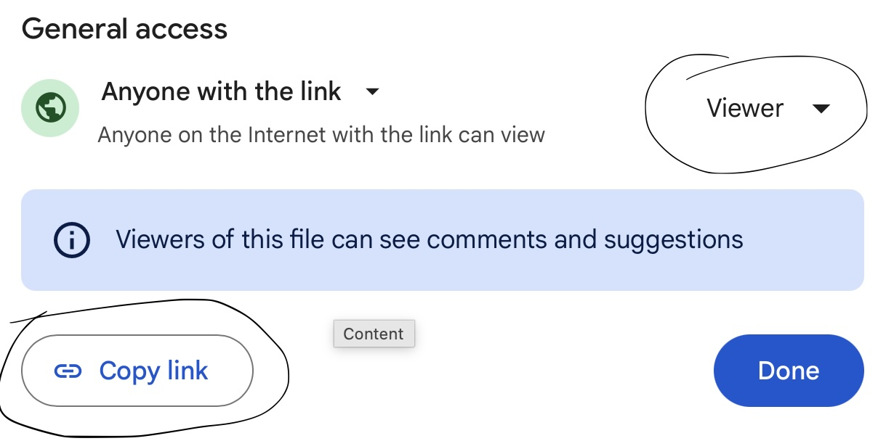
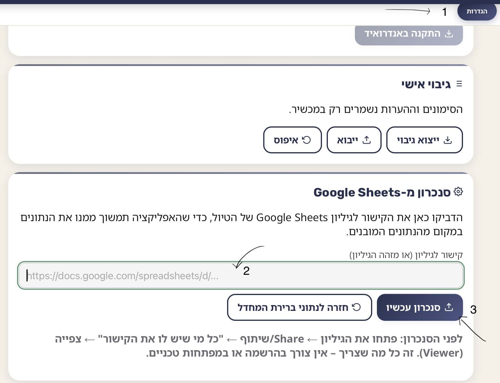

# **אפליקציה לתכנון טיולים בתצורת PWA עם תמיכה ב Excel / Google Sheets**

## עריכת התוכן

זו שיטת העבודה המקורית, המיועדת בעיקר למי שמתחזק/ת את הקוד עצמו:

1. פתחו את `source/trip-template.xlsx`.
2. ערכו את הגיליונות לפי הכותרות. אין לשנות את שמות הגיליונות או הכותרות.
3. הפעילו:
   `python tools/build_pwa.py`
4. התוצאה תיכתב ל־`data/trip-data.js` ול־`data/trip-data.json`.
5. יש להעלות (commit + push) את הקבצים המעודכנים לריפו כדי שהאתר המפורסם יתעדכן.

אם ברצונכם לאפשר לכל טיול/משפחה לנהל את הנתונים שלו בעצמו — **בלי לגעת בקוד ובלי להעלות כלום מחדש** — ראו את הסעיף הבא.

## סנכרון נתונים מ-Google Sheets (בלי לגעת בקוד)

האפליקציה יודעת למשוך את נתוני הטיול ישירות מגיליון **Google Sheets** ציבורי (חלק משירותי Google Drive), ולשמור עותק במכשיר לשימוש גם ללא אינטרנט. אין צורך במפתחות API, בפרויקט Google Cloud, או בהרשמה כלשהי — רק שיתוף רגיל של הגיליון.

### שלב 1 — הכנת הגיליון

- העלו את `source/trip-template.xlsx` אל **Google Drive** (או פשוט צרו גיליון Google Sheets חדש והעתיקו לתוכו את התוכן).
- ודאו ששמות שבע הכרטיסיות זהים **בדיוק** לאלה (אסור לשנות אף אחד מהם):
  `הגדרות`, `ימים`, `לוח זמנים`, `הזמנות`, `מסעדות`, `מלונות`, `משפטים`.
- ודאו ששורת הכותרות הראשונה בכל כרטיסייה תואמת בדיוק לעמודות הבאות:

  | כרטיסייה | עמודות נדרשות |
  |---|---|
  | הגדרות | שדה, ערך |
  | ימים | מזהה, יום, תאריך, יום בשבוע, עיר, כותרת, כותרת משנה, מזהה מלון, עומס, חג, חשוב לדעת, מה לקחת |
  | לוח זמנים | מזהה, מזהה יום, סדר, שעת התחלה, שעת סיום, כותרת, תיאור, תחבורה, מקום, חיפוש במפות, מזהה הזמנה, דורש אינטרנט |
  | הזמנות | מזהה, מזהה יום, שם, סטטוס, עדיפות, תאריך יעד, תאריך שימוש, שעה, הגעה מומלצת, עלות משוערת, קישור, הערות |
  | מסעדות | מזהה, ימים, אזור, שם, מטבח, מחיר, התאמה ללא חזיר, מומלץ להזמין, חיפוש במפות, אתר, הערות |
  | מלונות | מזהה, שם, עיר, כתובת, טלפון, חיפוש במפות, הערות |
  | משפטים | קטגוריה, עברית, יפנית, תעתיק |

- בעמודות שמכילות כמה שורות לתא אחד (כמו "חשוב לדעת", "מה לקחת", "ימים" במסעדות) — כל פריט בשורה נפרדת בתוך התא (Alt+Enter / Option+Enter ביצירת שורה חדשה בתוך תא).
- **טיפ לתאריכים ושעות:** מומלץ לעצב את עמודות התאריך/שעה כטקסט רגיל (Plain text) ולהקליד בפורמט `2026-09-20` ו-`19:40`. האפליקציה יודעת להתמודד גם עם תאי תאריך/שעה "אמיתיים" של Sheets, אבל טקסט רגיל הכי אמין.
- **חשוב:** השדות בגליון ההגדרות שולטים בתצוגה של טאב הדיבור ושפת הדיבור
שפת הביטויים =	יפנית
קוד קול = ja-JP
כדי לשנות את השפה בהתאם למשפטים שתכניסו, השתמשו בקוד השפה המתאים מהטבלה הזו https://www.techonthenet.com/js/language_tags.php

### שלב 2 — שיתוף הגיליון

- לחצו על כפתור **שיתוף** (Share) בפינה הימנית העליונה של הגיליון.
- שנו את ההרשאה הכללית ל**"כל מי שיש לו את הקישור"** (Anyone with the link), עם הרשאת **צפייה בלבד** (Viewer).
- העתיקו את הקישור (Copy link).

> **לתשומת לב לפרטיות:** שיתוף כזה חושף את תוכן הגיליון לכל מי שמחזיק בקישור (גם אם הוא לא מופיע בחיפוש). מומלץ לא לכלול בגיליון פרטים רגישים כמו מספרי כרטיס אשראי או סיסמאות.

### שלב 3 — חיבור בתוך האפליקציה

- פתחו את האפליקציה ← טאב **"הגדרות"**.
- הדביקו את הקישור לגיליון בשדה המתאים.
- לחצו **"סנכרון עכשיו"**.

### שלב 4 — סיום

- בסנכרון מוצלח האפליקציה תיטען מחדש עם הנתונים מהגיליון, והם יישמרו במכשיר — כך שהאפליקציה תמשיך לעבוד גם ללא אינטרנט, עד לסנכרון הבא.
- כדי לעדכן נתונים בהמשך: מספיק לערוך את הגיליון ב-Google Sheets וללחוץ שוב על "סנכרון עכשיו" בכל מכשיר — **אין צורך להעלות קבצים מחדש או לפרסם מחדש את האתר**.
- אם הסנכרון נכשל (למשל שם כרטיסייה לא תואם), תופיע הודעת שגיאה מפורשת, והנתונים הקיימים לא ייפגעו.
- אם משהו משתבש בכל זאת ומופיע מסך שגיאה, יש כפתור **"איפוס נתונים מסונכרנים"** שמחזיר לנתוני ברירת המחדל של האתר.

## הרצה מקומית

מתיקיית הפרויקט:
`python -m http.server 8080`
פתחו בדפדפן: `http://localhost:8080`

## פרסום

העלו את כל התיקייה לשירות אחסון סטטי עם HTTPS כגון GitHub Pages, Azure Static Web Apps, Netlify או Cloudflare Pages. שירות ה-Google Sheets sync פועל מכל דומיין כזה בלי שינוי נוסף.

## התקנה בטלפון

- iPhone/iPad: פתחו ב־Safari, לחצו שיתוף, הוספה למסך הבית, Open as Web App.
- Android: פתחו ב־Chrome, תפריט, Add to Home screen, Install.

## פרטיות

הסימונים האישיים, וכן העותק המקומי של נתוני הטיול שסונכרנו מ-Google Sheets (אם הוגדר סנכרון), נשמרים ב-localStorage במכשיר בלבד ואינם נשלחים לשום שרת חיצוני מלבד Google עצמה בזמן הסנכרון. מספרי הזמנה רגישים לא מומלץ לכלול בפרסום ציבורי או בגיליון משותף.

## השמעת משפטים ביפנית

במסך יפנית קיימים כפתורי השמעה רגילה, השמעה איטית ועצירה. ההקראה משתמשת בקול היפני המותקן במכשיר דרך Web Speech API, ללא מפתח API וללא עלות.
